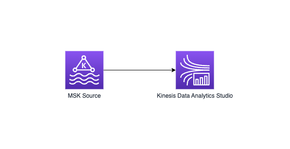

# MSK to Studio

This blueprint deploys a Studio app that reads from MSK Serverless using IAM auth using the Table API:



## Project details

1. Flink version: `1.15.2`
2. Python version: `3.8`

## Key components used

1. New (in Flink 1.13) `KafkaSource` connector (`FlinkKafkaSource` is slated to be deprecated).

## High-level deployment steps

1. Deploy associated infra (MSK and KDA Studio) using CDK script
2. Run Studio query to read from MSK topic

## Prerequisites

1. Maven
2. AWS SDK v2
2. AWS CDK v2 - for deploying associated infra (MSK and KDA app)

## Step-by-step deployment walkthrough

1. First, let's set up some environment variables to make the deployment easier. Replace these values with your own S3 bucket, app name, etc.

```bash
export AWS_PROFILE=<<profile-name>>
export APP_NAME=<<name-of-your-app>>
```

2. Follow instructions in the [`cdk-infra`](cdk-infra/README.md) folder to *deploy* the infrastructure associated with this app - such as MSK Serverless and the Kinesis Data Analytics Studio application.

3. Start your Kinesis Data Analytics Studio application from the AWS console.

4. Run Flink SQL query in Studio notebook to read from MSK topic.


## Launching via CloudFormation with pre-synthesized templates:

1. First, navigate to [the bootstrapping folder](/bootstrap-cdk/): `/bootstrap-cdk` and synthesize the template: `cdk synth`
2. Next, navigate to this blueprint's cdk-infra folder and type `cdk synth` to synthesize the template.
3. Finally, navigate to the root of the project. `/`

#### Bootstrap your account (run in root of project and change variables accordingly)

Copy and paste this command into a terminal in the root of the project to bootstrap the assets into your account.


```bash
export timestampToLetters=$(date +%s)
export BucketName=myblueprintdemoassets-${timestampToLetters}
export BootstrapStackName=bootstrap-my-account-${timestampToLetters}-stack
export BlueprintStackName=studio-demo-msk-studio-blueprint-${timestampToLetters}-stack
export AppName=studio-demo-${timestampToLetters}-app
export ClusterName=studio-demo-${timestampToLetters}-cluster
export GlueDatabaseName=studio_demo_${timestampToLetters}_db
export CloudWatchLogGroupName=blueprints/kinesis-analytics/${AppName}
export CloudWatchLogStreamName=kinesis-analytics-log-stream
export RoleName=studio-demo-${timestampToLetters}-role
export zepFlinkVersion=ZEPPELIN-FLINK-3_0

aws cloudformation create-stack --template-body file://./bootstrap-cdk/cdk.out/BootstrapCdkStack.template.json --stack-name ${BootstrapStackName} --parameters ParameterKey=assetBucket,ParameterValue=$BucketName ParameterKey=assetList,ParameterValue="https://data-streaming-labs.s3.amazonaws.com/blueprint-test/aws-lambda-helpers-1.0.jar\,https://data-streaming-labs.s3.amazonaws.com/blueprint-test/CdkInfraKafkaToStudioStack.template.json\,https://data-streaming-labs.s3.amazonaws.com/blueprint-test/my-deployment.zip" --capabilities CAPABILITY_IAM
```

### once bootstrapping finishes (in your AWS Console), then run next command from terminal: 

```bash
aws cloudformation create-stack --template-url https://${BucketName}.s3.amazonaws.com/CdkInfraKafkaToStudioStack.template.json --stack-name $BlueprintStackName --parameters ParameterKey=AppName,ParameterValue=$AppName ParameterKey=GlueDatabaseName,ParameterValue=$GlueDatabaseName ParameterKey=zepFlinkVersion,ParameterValue=$zepFlinkVersion ParameterKey=CloudWatchLogGroupName,ParameterValue=$CloudWatchLogGroupName ParameterKey=CloudWatchLogStreamName,ParameterValue=$CloudWatchLogStreamName ParameterKey=ClusterName,ParameterValue=$ClusterName ParameterKey=BucketName,ParameterValue=$BucketName ParameterKey=RoleName,ParameterValue=$RoleName --capabilities CAPABILITY_NAMED_IAM --disable-rollback
```

Now the blueprint will be launched in your account.