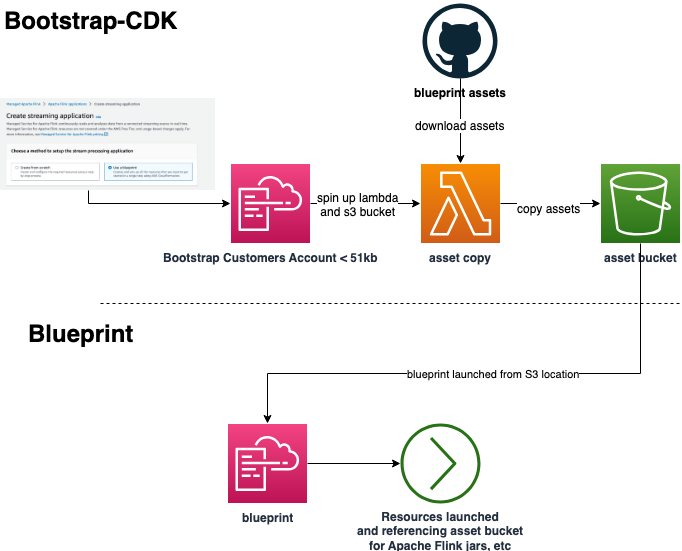

# Contributing


Want to create a new blueprint that will one day end up on the AWS management console and help other customers get started with Apache Flink? 

Blueprints for Managed Service for Apache Flink need to meet certain criteria that will be outlined here. Once this criteria has been met, you can submit a pull request to this repository 

## The Big Picture



Blueprints are essentially comprised of a CDK Script containing all resources needed for an end-to-end streaming pipeline including Managed Service for Apache Flink. Your blueprint should aid in users getting started with this service by removing any undifferentiated heavy lifting they might encounter.

There are some limitations in how blueprints should work, and one of those is how customers will launch blueprints. The blueprints are launched via the AWS management console, via the front end web client. This means that the front end team must launch the CloudFormation template in the user's account on their behalf. Due to limitations of the `create-stack` API, this means we must use the bootstrapping construct that exists within the Blueprints project in order to copy existing assets to a user's AWS account rather than depending on the CloudFormation template to have those assets within them.

1. Bootstrap template copies existing assets hosted on Github to user S3 bucket (specified in Bootstrapping Template)
2. Blueprint references S3 bucket that Bootstrapping template defined.

## The Criteria
Every Blueprint in this repository must be:
- Stored under the `apps/` directory in the API Layer that it relates to.
- Implemented in CDK (language non-specific)
- Ability to synthesize CDK Script into a standalone CloudFormation Template (no bootstrapping required)
- Compatibility with the Bootstrap CDK Module located in the root of the project (references assets in an existing S3 bucket for assets)
- A clear contract between what the template expects and what the front end should provide must be defined in documentation:
  - What parameters must be provided, etc.
- In the Managed Service for Apache Flink application created, the Application Properties must create a property group, `BlueprintMetadata`, containing two fields for the `StackId` and `BlueprintName` to assist with front end programming: 
```bash                  
    'PropertyGroupId': 'BlueprintMetadata',
        'PropertyMap': {
            'StackId': stack_id,
            'BlueprintName': blueprint_name
        }
```

## Open Projects Ideas
- Using existing resources
  - Ideally, we'd like a way for a blueprint to know whether or not a customer has already provisioned a resource like an MSK cluster before provisioning one for them, and connecting the Managed Service for Apache Flink to that resource.
  - A way to add additional components to the Managed Service for Apache Flink, like monitoring, alerts, scaling and CI/CD.
- Other blueprints
  - KDS to S3
  - PyFlink Table API
  - PyFlink Datastream API
  - Others... 
  Create a PR to signify you would like to begin work on one of these or other blueprints and the maintainers will be in touch.